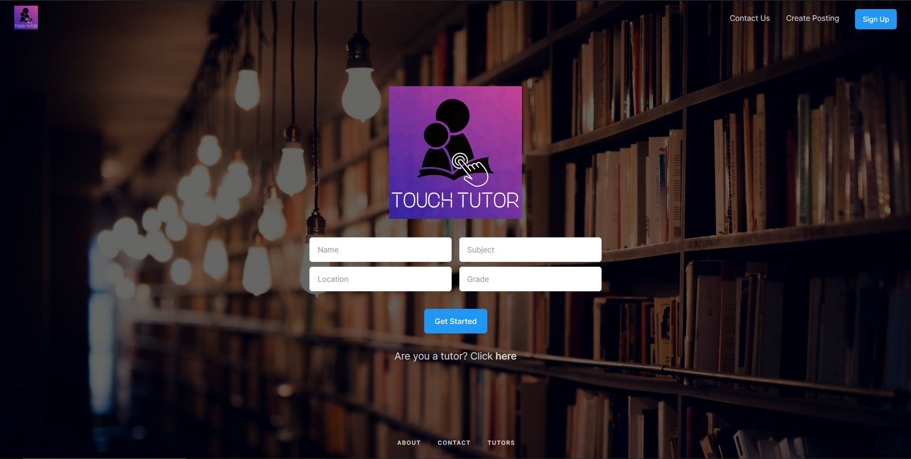

# [Touch Tutor](https://touchtutor.herokuapp.com/)

Today, distanced learning increases the disconnect between students and tutors by a lot. Students find it harder to find a tutor and tutors find it harder to find a student. To solve this, we created Touch Tutor. In order to get help, students simply search by subject, grade, and location, allowing our algorithm to determine the closest tutor that matches their criteria best. On the contrary, tutors can use this platform to augment their personal services by creating their personal profile and reaching an untapped, local user base. Once our algorithm matches a student and tutor, the transactions take place within Touch Tutor, providing privacy and security for both parties.

## Problem Description
In today's current state of pandemic, interactive educational experiences are at an all time low. Not only do students struggle to keep up with the demands of the curriculum, but faculty also experience difficulties in optimizing course content for an online environment. 
Nearly 67% percent of students feel that synchronous learning is not helpful, 60% of faculty believe that academic dishonesty is more prevalent, and the main concern of parents is the lack of collaborative learning. There is no doubt that a great disconnect between students, teachers, and the academic curriculum is ever present in our world today. Without consistent interaction between students and teachers, the educational system will continue to fall behind its own standards, stimulating an aftershock of halted innovation for years to come.

## What It Does
Touch Tutor is a multi-functional platform that connects students with the top of the line tutors in their area. In order to get help, students simply search by subject, grade, and location, allowing our algorithm to determine the closest tutor that matches their criteria best. On the contrary, tutors can use this platform to augment their personal services by creating their personal profile and reaching an untapped, local user base. Once our algorithm matches a student and tutor, the transactions take place within Touch Tutor, providing privacy and security for both parties.
Upon entering the website, users are greeted with the tutor search component, providing students with seamless access to our software. After inputting their search criteria, the tutor with the closest match will be displayed, along with their availability, fee, and contact information.
In order to create a profile, tutors and students can create an account, where basic information is recorded and stored in a database for future use. After creating an account, tutors can now publish job postings, which are used as cross-references in the matching process. If either tutors or students experience any problems, the contact us component allows the user to contact us directly, ensuring that no future issues arise.

## How We Built It
We decided to create our web application using [Flask](https://flask.palletsprojects.com/en/1.1.x/), which is a full stack web framework thats written in python. We also used the [MongoDB cloud service](https://www.mongodb.com/) to deploy our database. This solution structure allows us to scale up our product when needed and enables us to match together a large quantity of students and tutors.
Each different page on the web application has its own unique route that dictates what functions to run and which pages to display. Several of these routes contain methods that are specific to that route, such as insert_post(), which stores info about job postings in the database. Another function, get_tutor(), searches through our database of tutors and returns a list of tutors that match a certain criteria that the student specifies.
In addition, we used HTML pages in conjunction with python methods and our mongodb database to seamlessly display data that is created by functions or stored in our collections. This is done by utilizing the request.args method to retrieve data from the input boxes on the webpage and then process that data through functions and eventually into our collections. We also used the pymongo module to pull specific values about each tutor, such as their hourly price and phone number and then display those on the webpage using Flask’s render_template method.

## Challenges We Ran Into
We had difficulty retrieving and displaying a filtered list of tutors from our MongoDB database. As we solved this problem, we learned about cursor objects and how to parse through them. We also learned how to return specific dictionaries from cursor objects. This allowed us to retrieve the list of tutors as a cursor object and then easily display it on the web application. We also ran into the challenge of passing variables from one route to another. We explored the different methods that flask provides and found the render_template(), which helped solve this problem.

## Setup
Your machine will need flask, pymongo, dns, json, and bson to run this code. To get any of these libraries, you can just `pip install [insert library here]` in a terminal window. To run the code, first pull the github to your computer and then navigate to the folder where app.py is. Then open terminal and run the command `flask run`. This will direct you to a localhost website where you can interact with the product.

### Detailed Instructions:
1. Open command prompt
2. Install flask, pymongo, dns, json, and bson using `pip install [library name]`
3. Then download the github repo to your computer
4. Locate the repo in your file explorer
   -- Open command prompt from that folder's search bar by typing cmd into it
5. Then enter `flask run` in the command prompt
6. Copy the localhost link that is outputted and paste it into a web browser
7. Use the application in your browser

## Website
Visit [touchtutor.herokuapp.com](https://touchtutor.herokuapp.com/) to view the site.
